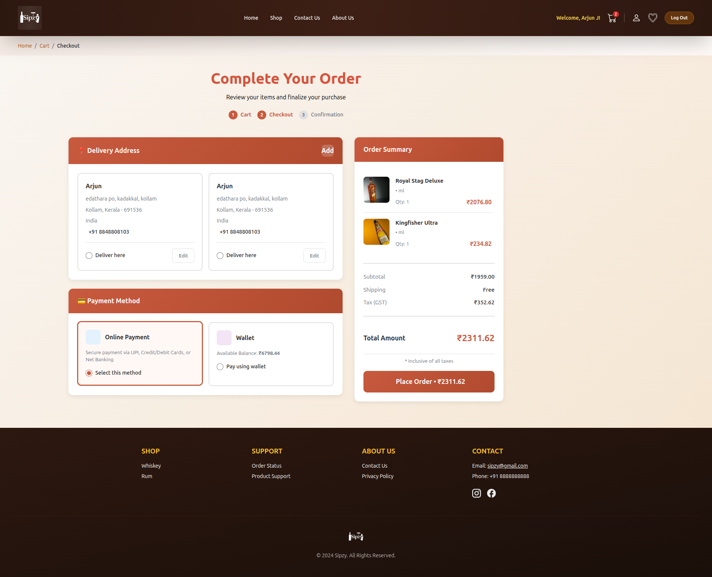

<div align="center">


<p>
  
</p>

<!-- Badges -->
<p>
  
  
  
  
  
</p>

</div>

---

##  **Problem Statement**

<table>
<tr>
<td width="50%">

### The Struggles

-  **Heavy Lifting** - Carrying bulky liquor bottles from stores
-  **Limited Variety** - Physical stores have restricted inventory
-  **Manual Errors** - Billing mistakes & discount miscalculations
-  **Payment Issues** - Lack of secure digital payment options

</td>
<td width="50%">

### Our Solution

- **Home Delivery** - No more heavy lifting
- **Vast Selection** - Access to premium drinks online
- **Smart Discounts** - Automated coupon validation
- **Secure Payments** - Wallet & Razorpay integration

</td>
</tr>
</table>

---

## **About Sipzy**

<div align="center">

</div>

**Sipzy** is a modern **liquor e-commerce platform** designed to revolutionize how people shop for premium beverages. Born from observing the real-world challenge of transporting heavy bottles, Sipzy brings the entire shopping experience online — from browsing to checkout.

```
Browse →  Select → Pay →  Delivered!
```

---

##  **Key Features**

<div align="center">

|  **Cart Management** |  **Offers & Coupons** |  **Payments** |  **Security** |
|:---:|:---:|:---:|:---:|
| Stock validation | Rule-based discounts | Dual payment modes | Django auth |
| Real-time pricing | Fraud prevention | Razorpay integration | Data encryption |
| Quantity controls | Usage tracking | Wallet system | Secure sessions |

</div>

---

## **Tech Stack**

<div align="center">


</div>

<table align="center">
<tr>
<td align="center" width="33%">

### **Backend**


Clean MVC architecture with Django

</td>
<td align="center" width="33%">

###  **Database**


Robust relational database

</td>
<td align="center" width="33%">

###  **Frontend**


Modern UI with Tailwind CSS

</td>
</tr>
</table>

---

##  **Installation & Setup**

<div align="center">

</div>

###  **Prerequisites**
```bash
Python 3.8+
PostgreSQL 12+
pip (Python package manager)
```

###  **Clone the Repository**
```bash
git clone https://github.com/arjunj20/sipzy_project.git
cd sipzy_project
```

###  **Create Virtual Environment**
```bash
python -m venv venv

# Windows
venv\Scripts\activate

# macOS/Linux
source venv/bin/activate
```

###  **Install Dependencies**
```bash
pip install -r requirements.txt
```

###  **Configure Database**
```python
# settings.py
DATABASES = {
    'default': {
        'ENGINE': 'django.db.backends.postgresql',
        'NAME': 'sipzy_db',
        'USER': 'your_username',
        'PASSWORD': 'your_password',
        'HOST': 'localhost',
        'PORT': '5432',
    }
}
```

###  **Run Migrations**
```bash
python manage.py makemigrations
python manage.py migrate
```

###  **Create Superuser**
```bash
python manage.py createsuperuser
```

###  **Start Development Server**
```bash
python manage.py runserver
```

 **Visit:** `http://127.0.0.1:8000/`

---

##  Screenshots

###  Home Page


###  Shopping Cart


###  Checkout



##  **Contributing**

<div align="center">

</div>

We welcome contributions! Here's how you can help:

1.  **Fork** the repository
2.  **Create** a feature branch (`git checkout -b feature/AmazingFeature`)
3.  **Commit** your changes (`git commit -m 'Add some AmazingFeature'`)
4.  **Push** to the branch (`git push origin feature/AmazingFeature`)
5.  **Open** a Pull Request

---

##  **License**

<div align="center">

This project is licensed under the **MIT License** - see the [LICENSE](LICENSE) file for details.

[](https://opensource.org/licenses/MIT)

</div>

---

##  **Author**

<div align="center">

### **Arjun J**

[](https://github.com/arjunj20)
[](https://linkedin.com/in/arjun-j)
[](https://arjunj20.github.io/Portfolio/)

**Made with Python and Django**

</div>

---

<div align="center">

<!-- Footer Wave -->


###  **If you found this project helpful, give it a star!** 

</div>
